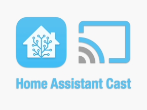

# Roku Home Assistant Cast App

Roku app to allow Home Assistant integration video stream cameras and other media to Roku devices.

## How to Deploy the app to your Roku


In order to side load an application on Roku you need to follow a few steps:

1. Set up your Roku device to enable **Developer Settings** on your Roku device (Step 1 of [these instructions](https://developer.roku.com/en-gb/docs/developer-program/getting-started/developer-setup.md))
2. Create a zip file with the contents of this repository or download the zip from the [Releases](releases) page
3. Access the **Development Application Installer** to upload and install the app package (Steps 2 and 3 of [these instructions](https://developer.roku.com/en-gb/docs/developer-program/getting-started/developer-setup.md))

A couple of notes:

- If you run the app from Roku UI it will display a message: _"App started with no deep link, use HA Roku custom component to stream a camera or other media."_ this is normal, see the sections below to learn how to use the application with Home Assistant or directly stream content using an URL with `deep link`.
- If you use VSCode, it's recommended to use the [_BrightScript Language Extension_](https://marketplace.visualstudio.com/items?itemName=RokuCommunity.brightscript) that allows you execute the steps 2 and 3 above just using VSCode's **Run** command.

## How to show a Home Assistant camera on Roku

Once you have the **Home Assistant Cast** app installed follow the steps below to have a camera streaming to your Roku:

1. Install [**Custom Roku Media Player**](https://github.com/lvcabral/ha-roku-media-player) integration on you Home Assistance and restart it.
1. Have your Roku device properly configured in Home Assistant with an Entity on `media_player` platform (e.g `media_player.roku_ultra`)
1. Create an Automation with an action that calls the service `camera.play_stream` from one of your cameras to your Roku entity.

Below is an example of an Automation that shows the front door Floodlight Camera on Roku when the motion sensor is triggered.

```YAML
alias: Stream Camera on Motion Detected
description: ''
trigger:
  - platform: state
    entity_id: binary_sensor.backyard_motion
    to: 'on'
condition: []
action:
  - service: camera.play_stream
    target:
      entity_id:
        - camera.floodlight_camera
    data:
      media_player: media_player.roku_ultra
      format: hls
mode: single
```

## How to Manually Send a Stream to the Roku app

If you want to test the app without the use of Home Assistant, you can use the command below in your terminal.
Please note:

- Make sure you replace the `IP address` below with the one your Roku device is using
- The `contentId` parameter can contain any valid stream URL supported by Roku (hls, mp4, mkv,...) make sure you [encode it](https://www.urlencoder.io/)
- Alternatively you can send the parameters used by the "Play On Roku" secret channel
  - `u` - Contains the `url` for the stream
  - `t` - Contains the type of stream: `v` for video or `a` for audio
  - `videoFormat`: Contains the video format, for example `hls`, `mp4`
  - `songFormat`: Contains the audio format, for example `mp3`, `wma`
  - `songName`: Contains the name of the music/audio being played

```zsh
curl -d '' 'http://192.168.0.74:8060/launch/dev?contentId=https%3A%2F%2Fjell.yfish.us%2Fmedia%2Fjellyfish-30-mbps-hd-h264.mkv'
```

## License

Copyright (C) 2022 Marcelo Lv Cabral. All rights reserved.

Licensed under [MIT](LICENSE) License.
